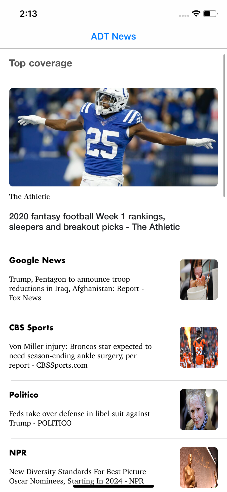

<p align = "center"> 

</p>
<div align="center">
 <h2> ADT NEWS </h2>
</div>
<p align = "center"> 
<a href="https://github.com/amitbiswas1992/githubexplorer"></a>
</p>


 

## Summary

This is a small news application where all the news feeds are coming from an opensource news API. All the news feed will populate in the custom-designed tableView cell, and by tapping each section, the particular news will open in a web browser.


<p align = "center"> 

</p>

## Used technology 

* Swift 5.0
* Xcode 11.5
* UITableViewController 
* UINavigationController
* UIRefreshControl


### Clone

- Clone this repo to your local machine using `https://github.com/fvcproductions/SOMEREPO`

### Note 

- For the security reason , it's recommneded to use your own  API key 

```swift
// code away!

let apiKey = "INSERT YOUR API KEY HERE"
```

###  Thank You !  Happy Coding :)


